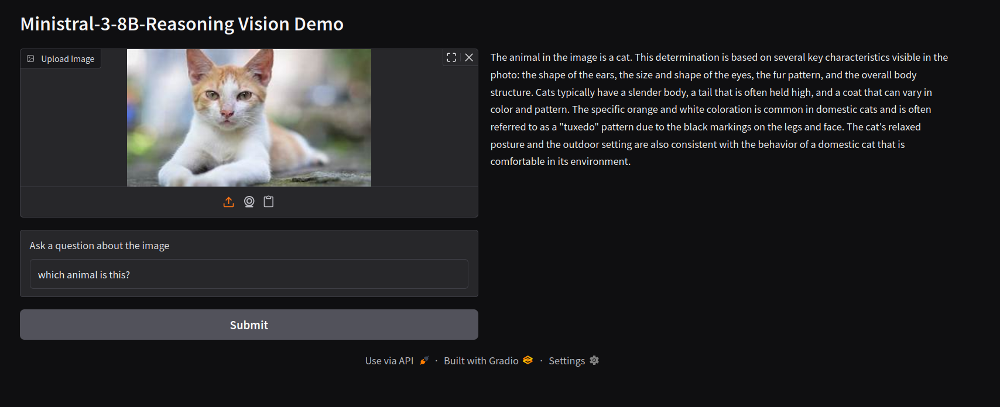

<div align="center">
  
  
  <h1>Ministral 3-8B Vision (Local & Quantized)</h1>
</div>

Run the powerful **Ministral-3-8B-Reasoning** model with vision capabilities locally on consumer hardware (tested on **NVIDIA RTX 3060 Ti 8GB**).

This project demonstrates how to use the **Unsloth 4-bit quantized** version of the model with a modern **Gradio** frontend for image analysis and reasoning.




## 🚀 Features

*   **Local Inference**: Runs entirely on your machine. No API keys, no data privacy concerns.
*   **Vision Capabilities**: Upload images and ask complex reasoning questions.
*   **Efficient**: Uses 4-bit quantization (BitsAndBytes) to fit within 8GB VRAM.
*   **Modern UI**: Clean, vertical layout built with Gradio 6.x.

## 🛠️ Requirements

*   **GPU**: NVIDIA GPU with at least **8GB VRAM** (e.g., RTX 3060 Ti, 3070, 4060).
*   **OS**: Linux (tested) or Windows (WSL2 recommended).
*   **Python**: 3.10+

## 📦 Installation

1.  **Clone the repository**:
    ```bash
    git clone https://github.com/yourusername/ministral-vision-local.git
    cd ministral-vision-local
    ```

2.  **Create a virtual environment** (recommended):
    ```bash
    python -m venv venv
    source venv/bin/activate  # On Windows: venv\Scripts\activate
    ```

3.  **Install dependencies**:
    ```bash
    pip install -r requirements_ministral.txt
    ```

## 🏃‍♂️ Usage

1.  **Run the application**:
    ```bash
    python main.py
    ```
    *The first run will download the model weights (~5GB) and tokenizer.*

2.  **Open your browser**:
    Navigate to `http://localhost:7860`.

3.  **Interact**:
    *   Upload an image.
    *   Ask a question (e.g., "Describe the main object," "What is unusual about this scene?").
    *   Click **✨ Analyze Image**.

## 🏗️ Architecture

The project is structured for modularity and maintainability:

*   `backend/`: Handles model loading and inference logic.
*   `frontend/`: Manages the Gradio UI and styling.
*   `config.py`: Centralizes configuration constants.
*   `main.py`: The entry point that ties everything together.

## 🔗 Model Links

*   **Model Weights (4-bit)**: [unsloth/Ministral-3-8B-Reasoning-2512-bnb-4bit](https://huggingface.co/unsloth/Ministral-3-8B-Reasoning-2512-bnb-4bit)
*   **Base Model**: [mistralai/Ministral-3-8B-Reasoning-2512](https://huggingface.co/mistralai/Ministral-3-8B-Reasoning-2512)

## 🔧 Troubleshooting

*   **`ImportError: libGL.so.1`**: If you see this, you might need to install system OpenCV dependencies:
    ```bash
    sudo apt-get update && sudo apt-get install libgl1
    ```
*   **OOM (Out of Memory)**: If you have less than 8GB VRAM, try closing other applications. The 4-bit model requires roughly 6-7GB VRAM.

## 📜 Credits

*   **Model**: [Ministral-3-8B-Reasoning](https://huggingface.co/mistralai/Ministral-3-8B-Reasoning-2512) by Mistral AI.
*   **Quantization**: [Unsloth](https://huggingface.co/unsloth) for the 4-bit BNB version.
*   **Frontend**: Built with [Gradio](https://gradio.app/).

---
*Created by CiscoPonce*
